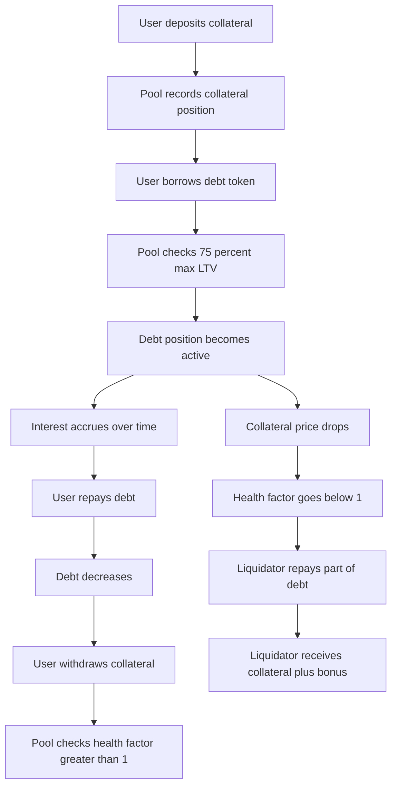
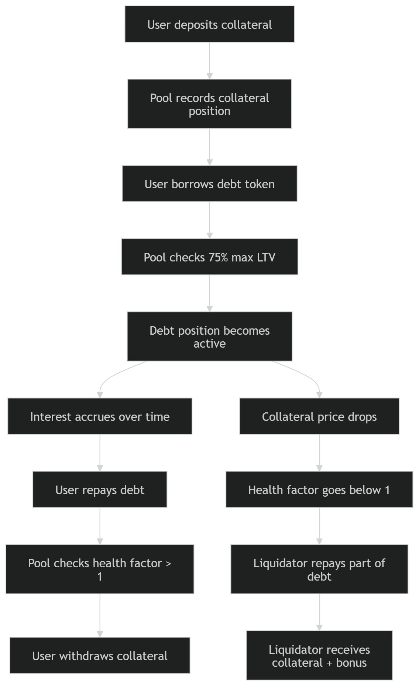

# Task 5: Lending Protocol Simulation

## Overview

This task implements a simplified lending and borrowing protocol with:

- collateral deposits
- borrowing against collateral
- repayment
- collateral withdrawal with health-factor checks
- liquidation of unhealthy positions
- linear interest accrual over time

Implementation files:

- [LendingPool.sol](C:\Users\hp\blockchain2 assignment2\src\task5\LendingPool.sol)
- [MockPriceOracle.sol](C:\Users\hp\blockchain2 assignment2\src\task5\MockPriceOracle.sol)
- [LendingPool.t.sol](C:\Users\hp\blockchain2 assignment2\test\task5\LendingPool.t.sol)

## Model

The protocol uses:

- one collateral token
- one debt token
- a price oracle with collateral and debt prices
- a maximum LTV of `75%`
- a liquidation bonus of `5%`
- a simple linear annual interest model

Health factor is computed as:

```text
healthFactor = (collateralValue * 75%) / debtValue
```

Scaled by `1e18`, so:

- `healthFactor > 1e18` means healthy
- `healthFactor = 1e18` means exactly at threshold
- `healthFactor < 1e18` means liquidatable

## Workflow Diagram




## What Was Tested

The test suite covers:

- deposit and withdrawal flow
- borrowing within LTV
- borrowing above LTV and revert behavior
- borrowing with zero collateral
- partial repayment
- full repayment
- withdrawal blocked when health factor becomes too low
- withdrawal allowed when position remains healthy
- interest accrual over time using `vm.warp`
- liquidation after collateral price drop
- liquidation blocked when position is still healthy
- position reporting through `getPosition`

The suite contains `13` passing tests, which exceeds the assignment minimum of `10`.

## Run Commands

```powershell
.\.foundry\bin\forge.exe test --match-path test/task5/LendingPool.t.sol -vvv
.\.foundry\bin\forge.exe test --match-path test/task5/LendingPool.t.sol --gas-report
```

## Notes

- The implementation is intentionally simplified for educational purposes.
- Debt liquidity is pre-funded in tests by minting the borrow token to the pool.
- Price movements are simulated by updating the mock oracle.
